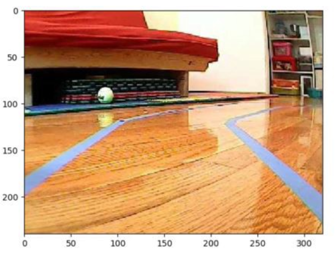
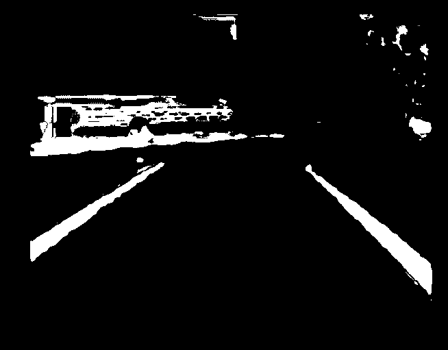
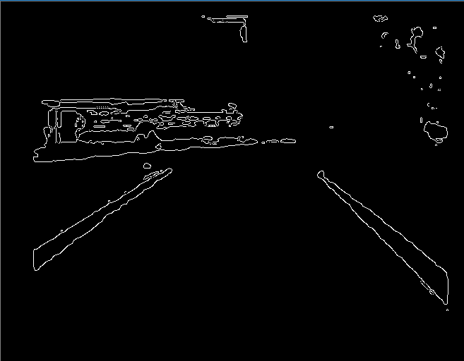
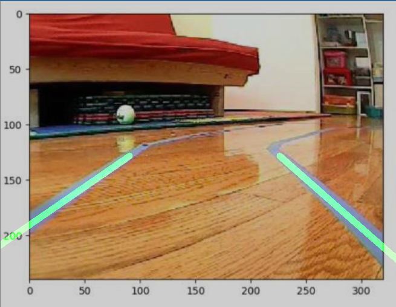
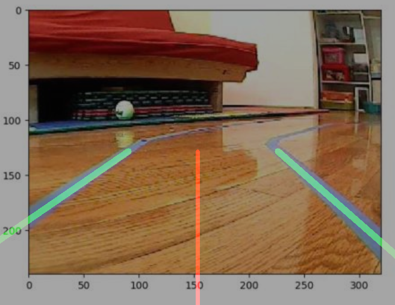

Process
--------
Source-code by [David Tian](https://towardsdatascience.com/deeppicar-part-4-lane-following-via-opencv-737dd9e47c96)
1. input frame
2. blue-color filter
3. Canny Edge Detector
4. Hough Line Transform
5. Derive lane-lines
6. Draw heading

